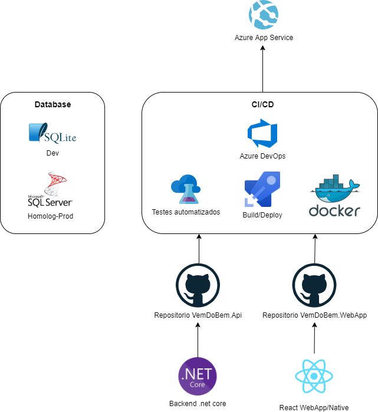

# Documentação da arquitetura de aplicação

A ideia é um sistema monolitico muito simples:
- Backend em .net core;
- Front React/React-native;
- Base de dados no principio do desenvolvimento vai ser sqlite pela simplicidade para começar, depois, provável sql server ou algum nosql, em real, o que ficar com um custo benefício melhor atendendo à demanda;
- Utilizaremos o azure devops para fazer o build, testes, e deploy do container docker;
- A principio vamos publicar no azure app services, estudaremos opções mais em conta.

Segue diagrama ilustrando o esquema:

