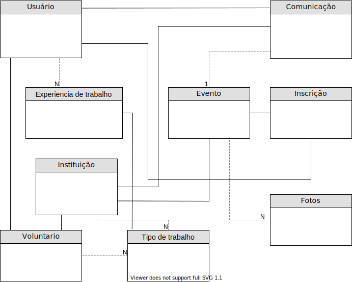

# Documentação de domínio

As endidades principais do sistema serão a entidade, voluntário e eventos. Além de entidades perifericas que compõem a dimámica do app.

As entidades constituem (atributos das entidades podem ser encontrados no código fonte):
- Usuário;
- Instituição;
- Voluntário;
- Tipo de trabalho;
- Experiência de trabalho;
- Evento;
- Inscrição;
- Comunicação;
- Fotos.

Segue o mapeamento inicial das entidades e relacionamentos (os atributos das entidades, poderão ser visualizadas no código): 

- Um usuário pode criar uma nova instituição, ou se associar como voluntário de alguma existente;
- Um usuário pode cadastram 1 ou mais experiências de trabalho, estas vão ser apresentadas à instituição no momento de uma candidatura à voluntário;
- Uma instituição pode criar um Evento;
- Um usuário pode se inscrever à um evento cadastrado por uma instituição existente;
- Na instrição como voluntário um usuário pode informar tipos de trabalho que gostaria de desempenhar;
- Uma instituição pode se comunicar com um usuário por meio da entidade Comunicação e vice e versa;
- Uma comunicação pode ou não estar atrelada à um evento;
- Um evento pode ter uma coleção de imagens

