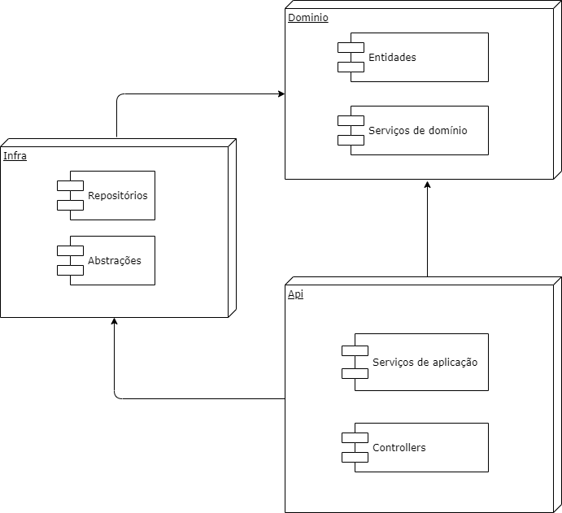

# Documentação da arquitetura de software do backend

Será uma api monolitica utilizando um modelo de camadas baseado no modelo de domínio recomendado para projetos que utilizam a metodologia DDD. Contudo, será um modelo muito simplificado sem tantas camadas, apenas camada de domíno, infra e Api.

- Domínio: Camada que contém as entidades, propriedades e comportamentos, bem como serviços de dominio com regras de negocio pertinentes ao domínio da aplicação;
- Infra: Código de infraestrutura, para interagir com frameworks, apis e libs externas, criando abstrações onde necessário para utilizar nas demais camadas por meio de injeção dependencia;
- Api, camada que fornece as apis rest, também é onde teremos as classes de serviço de aplicação quando necessário, essa camada vai cuidar do fluxo de execução, utilizar as interfaces e finalizar o fluxo, comitar propagar notificações para o front-end e etc;

Segue um diagrama básico (consultar código para mais detalhes)

