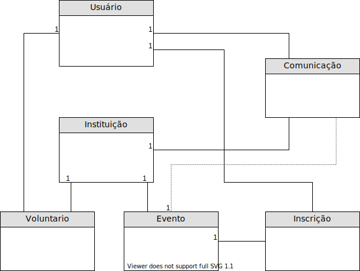

# VemDoBem.Api

Repositorio com as operações básicas do projeto "O que vem do bem".

No momento estão em desenvolvimento as seguintes funcionalidades:

- Cadastro de usuário;
- Cadastro de Instituição;
- Cadstro de evento;
- Subscrição de usuário como voluntário da insitituição/evento;
- Sistema de comunicação entre instituição e voluntário.

Segue o mapeamento inicial das entidades e relacionamentos: 

- Um usuário pode criar uma nova instituição, ou se associar como voluntário de alguma existente;
- Um usuário pode se inscrever à um evento cadastrado por uma instituição existente;
- O sistema de comunicação irá servir para que insitituição e voluntários se comuniquem, e também para retorno (a ser realizado pelas duas partes) sobre trabalhos realizados em eventos realizados, esses retornos podem ser públicos ou privádos.
