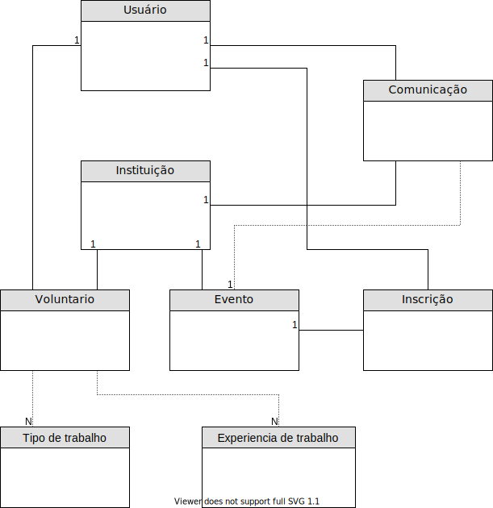

# VemDoBem.Api

Repositorio com as operações básicas do projeto "O que vem do bem".

O projeto consiste em uma plataforma para que instituições que prestam trabalho voluntário se cadastrem e cadastrem seus eventos ou trabalhos realizados que necessitma de voluntários. E também para que pessoal se cadastrem como voluntários e possam encontrar trabalhos ou serem encontradas por instituições à procura de voluntários.

No momento estão em desenvolvimento as seguintes funcionalidades:

- Cadastro de usuário;
- Cadastro de Instituição;
- Cadstro de evento;
- Subscrição de usuário como voluntário da insitituição/evento;
- Sistema de comunicação entre instituição e voluntário;
- Registro e galeria de fotos em eventos realizados.

Segue o mapeamento inicial das entidades e relacionamentos (os atributos das entidades, poderão ser visualizadas no código): 

- Um usuário pode criar uma nova instituição, ou se associar como voluntário de alguma existente;
- Um usuário pode se inscrever à um evento cadastrado por uma instituição existente;
- O sistema de comunicação irá servir para que insitituição e voluntários se comuniquem, e também para retorno (a ser realizado pelas duas partes) sobre trabalhos realizados em eventos realizados, esses retornos podem ser públicos ou privádos.
